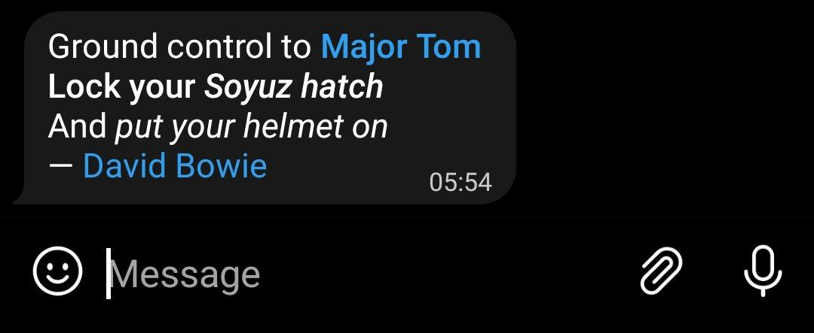

# Formatting messages

> The Bot API supports basic formatting for messages. You can use bold, italic, underlined, strikethrough, and spoiler text, as well as inline links and pre-formatted code in your bots' messages. Telegram clients will render them accordingly. [[Read more]](https://core.telegram.org/bots/api#formatting-options)

There are 3 ways to format messages sent to Telegram with Telegraf:

* [Markdown](#markdown)
* [HTML](#html)
* [fmt helpers](#fmt) (recommended!)

## Markdown

Markdown is the easiest answer to formatting, but it comes with its downsides.

> For supported Markdown syntax, refer to https://core.telegram.org/bots/api#markdownv2-style
>
> "Markdown" (before MarkdownV2) is a legacy mode, and must not be used. Use "MarkdownV2" instead.

```TS (Node)
// Inside a handler
ctx.replyWithMarkdownV2("*Bold*, _italic_, and __underlines__\\!");

// Anywhere
bot.telegram.sendMessage("*Bold*, _italic_, and __underlines__\\!", { parse_mode: "MarkdownV2" });
```

Since a variety of characters are reserved for Markdown syntax, if you want to use the character as-is in your text, you must escape it with a `\`. Since `\` by itself is an escape character, it must be escaped again, with `\\`. For example:

```TS (Node)
// Inside a handler
ctx.replyWithMarkdownV2("Sending an asterisk: \\*"); // sends "Sending an asterisk: *"
```

## HTML

While HTML is more verbose than Markdown, fewer characters need escaping.

> For a list of supported tags, refer to https://core.telegram.org/bots/api#html-style

```TS (Node)
// Inside a handler
ctx.replyWithHTML("`<b>`Bold</b>, <i>italic</i>, and <u>underlines</u>!");

// Anywhere
bot.telegram.sendMessage("`<b>`Bold</b>, <i>italic</i>, and <u>underlines</u>!", { parse_mode: "HTML" });
```

## fmt

While HTML and Markdown are the most popular options, a new feature (since v4.10.0) called `fmt` is recommended. While using `fmt`, you may write native-JavaScript template strings, and Telegraf will construct entities for you, and you'll require no escaping and no parse_mode!

> Internally, fmt creates entities. Read more about entities here: https://core.telegram.org/bots/api#formatting-options

```TS (Node)
import { fmt, bold, italic, underline } from "telegraf/format";

// Inside a handler
ctx.sendMessage(fmt`
${bold`Bold`}, ${italic`italic`}, and ${underline`underline`}!
`);
```

You can also naturally nest according to [Formatting options](https://core.telegram.org/bots/api#formatting-options).

```TS (Node)
import { fmt, bold, italics, mention } from "telegraf/format";

// Inside a handler
ctx.reply(fmt`
Ground control to ${bold`${mention("Major Tom", ctx.from.id)}`}
${bold`Lock your ${italic`Soyuz hatch`}`}
And ${italic`put your helmet on`}
— ${link("David Bowie", "https://en.wikipedia.org/wiki/David_Bowie")}
`);
```

This is what that looks like:



`fmt` also just works with captions, and even with only one of the helpers!

```TS (Node)
// Inside a handler, different variants of using fmt and bold
ctx.replyWithPhoto(file.id, { caption: fmt`File name: ${bold(fileName)}` });
ctx.replyWithPhoto(file.id, { caption: bold`File name: ${fileName}` });
ctx.replyWithPhoto(file.id, { caption: bold(fileName) });
```

---

### Available format helpers:

You need to import the helpers from `"telegraf/format"`. Example:

```TS (Node)
import { fmt, bold } from "telegraf/format";
```

Once imported, you can use them as documented below:

---

#### bold, italic, underline, strikethrough, spoiler

All of these fmt helpers are used in the exact same way. Each of them can be nested and can contain any of the others.

```TS (Node)
// As a tagged template literal, allows string interpolation and nested formatting

// Here, only `name` is underlined
fmt`Hello, ${underline`${name}`}`;

// The entire text is bold, but `name` is also italic
bold`Hello, ${italic`${name}`}`;

// As a function, accepts a single string, and does not support nesting
bold("Hello, " + name);
```

---

#### code

`code` does not support nesting! Used to format as inline monospaced text.

```TS (Node)
// As a tagged template literal, allows string interpolation.
code`Hello, ${name}`;

// As a function, accepts a single string, and does not support nesting
code("Hello, " + name);
```

---

#### pre

`pre` accepts language as a first-parameter, and like `code`, does not support nesting! Used to format as pre-formatted code block.

```TS (Node)
// As a tagged template literal, allows string interpolation.
pre("TypeScript")`Hello, ${name}`;

// As a function, accepts a single string, and does not support nesting
pre("TS")("Hello, " + name);
```

---

#### link

`link` is used to create an inline link, which is similar to an anchor <kbd>\<a href="url"></kbd> in HTML. This helper can only be used as a function, and does not support nesting:

```TS (Node)
link("Link text", URL);
```

---

#### mention

`mention` is used to link to a user by their ID. To use their username, simply use `@username` without any entity. This helper can only be used as a function, and does not support nesting:

```TS (Node)
mention("User", userId);
```
